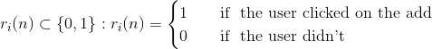

## The Multi-Armed Bandit Problem

- We have *d* arms(actions). For example, arms could be a series of campaign ads and our goal is to identify the most successful within users. 

- Each time an user is exposed to an ad, we complete a round(episode).

- At each round *n*, we choose one ad to display.

- Al each round *n*. an ad gives a reward according to:
  $$
  r_i(n) \subset \{0,1\}:  r_i(n) =
    \begin{cases}
      1       & \quad \text{if } \text{ the user clicked on the add}\\
      0  & \quad \text{if }  \text{ the user didn't}
    \end{cases}
  $$

  
- Our goal is to maximize the total reward we get over many rounds.     